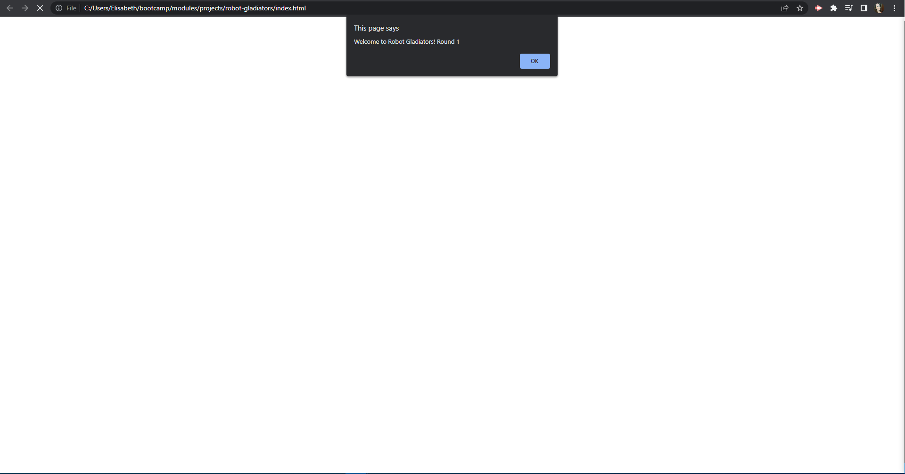

# robot-gladiators

## Purpose
Utilize JavaScript to build a browser-based video game that will be entered in a fictional hackathon called the Con Solo Game Jam

## Built With
* HTML (unedited except for title)
* CSS (unedited)
* JavaScript

## Website
https://ezaiger.github.io/robot-gladiators/

## Contribution
* Original code provided by courses.bootcampspot.com
* Code entered and studied/reviewed by EZaiger

## Notes
* This module was not cohesive to a proper learning experience and needs to be reviewed for accuracy.

